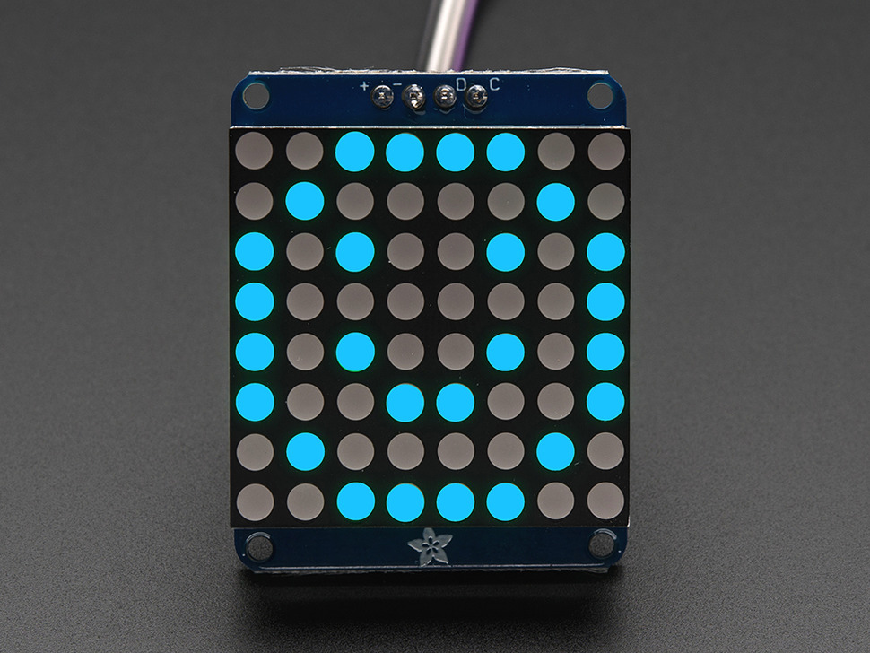

Using an LED matrix, you too can make a little tengu like robot.

Making it look like it is speaking isn't that hard. The trick is to
change the shape of the mouth depending on what letter it is trying to
speak (TTS or text-to-speech) as shown below.

