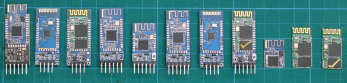

# Bluetooth for Robots

All bluetooth devices can be modified with AT commands and most default to 9600. Also 
some at 5V TTL while others (newer ones?) are 3.3V TTL.

- HC-05 can be master/slave
- HC-06 can only be a slave
- HM-10 BLE can be set to be used as a beacon.

# References

- [martyncurrey.com: bluetooth modules](http://www.martyncurrey.com/bluetooth-modules/#HC-05-ZG-B23090W)
- [martyncurrey.com: HM-10 Bluetooth 4 BLE modules](http://www.martyncurrey.com/hm-10-bluetooth-4ble-modules/)
