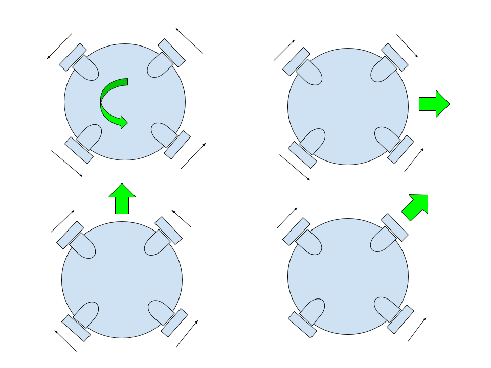

Robots come in a variety of types and configurations: wheeled, tracked,
legs, flying, etc. Common wheeled robots typically have two wheels
(directly driven) with a caster wheel to make the robot stable. There
are some without the caster wheel and employ a control system to keep
them upright (inverted pendulum problem) and resemble a Segway scooter.
All of these two wheeled robot are non-holonomic systems.

**Non-Holonomic System**

:   A non-holonomic system in physics and mathematics is a system whose
    state depends on the path taken to achieve it. An automobile is an
    example of a non-holonomic vehicle. The vehicle has three degrees of
    freedom: its position in two axes, and its orientation relative to a
    fixed heading. Yet it has only two controllable degrees of freedom:
    acceleration/braking and the angle of the steering wheel---with
    which to control its position and orientation. [^1]

Due to these constraints, a holonomic robot (figref{soccer\_robot})
which could travel in any direction and immediately change its position
and orientation is much more desirable. There are a variety of different
wheels which make this type of robot possible such as mecanum or omni
wheels (figref{wheel}).[^2][^3]

![Holonomic soccer robot using 4 omni directional wheels and a kicking
motor used to hit the red ball into a
goal.[^4]](holonomic_robot.png){.align-center width="300px"}

Omni wheels operate like standard wheels in that the force is produced
normal to the motor\'s axis of rotation and as a result of friction.
However, there are a series of smaller wheels which ring the main wheel
and allow the wheel to slip in the direction of the motor rotational
axis. Note that no force is produced parallel to the motor axis, just
slippage.

![Omni directional wheel allows movement in any
direction.[^5]](omni_wheel.jpg){.align-center width="300px"}

Omni wheels allow you to decouple position and orientation. These are
common in soccer robots.

{.align-center width="500px"}

Holonomic Dynamics
------------------

{.align-center
width="500px"}

The dynamics for a holonomic robot, such as figref{coordinate}, with 4
omni directional wheels (can be derived using Euler-Largrange
($\mathcal{L}$) which defines a system\'s kinectic ($T$) and potential
($V$) energies in relation to a set of generalized coordinates ($q$) and
generalized forces ($Q$):

\newcommand{\dpar}[2]{\frac{\partial #1}{\partial #2}}

$$
\mathcal{L} = T - V \\
\frac{d}{dt} \left\{ \dpar{ \mathcal{L} }{\dot q} \right\} - \dpar{ \mathcal{L} }{q} = Q \\
T = \frac{1}{2}M v_w^2+ \frac{1}{2}J \dot \psi^2 + \frac{1}{2} J_w (\dot \theta_1^2 + \dot \theta_2^2 + \dot \theta_3^2 + \dot \theta_4^2) \\
V = 0
$$

However, the dynamics must be calculated from an inertial reference
frame (${W}$) and take into account the rotating body frame dynamics
(${B'}$). Now, assume the body frame is offset from the center of mass (
CM) by $x_m$ and $y_m$ which compose a vector $r_m$. Thus the velocity
of the robot in the rotating frame would be:

$$
v_w = v_{B'} + \dot \psi \times r_m \\
v_w = v_{B'} +
\begin{bmatrix}
     0 & 0 & \dot \psi
\end{bmatrix}^T
\times
\begin{bmatrix}
     x_m & y_m & 0
\end{bmatrix}^T
=
\begin{bmatrix}
     \dot x & \dot y & 0
\end{bmatrix}^T +
\begin{bmatrix}
     -y_m \dot \psi & x_m \dot \psi & 0
\end{bmatrix}^T \\
v_{B'} = \begin{bmatrix}
     \dot x & \dot y & 0
\end{bmatrix}^T
$$

where $v_{B'}$ is the speed of the body frame. Now substituting that
into the above kinetic energy equation $T$, we get:

$$
T = \frac{1}{2}M( ( \dot x - \dot \psi y )^2 + (\dot y + \dot \psi x)^2)+ \dots \\
 T = \frac{1}{2}M( \dot x^2 - 2 \dot \psi y_m \dot x +\dot \psi^2 y_m^2 + \dot y^2 + 2 \dot \psi x_m \dot y + \dot \psi^2 x_m^2)+ \frac{1}{2}J \dot \psi^2 + \frac{1}{2} J_w (\dot \theta_1^2 + \dot \theta_2^2 + \dot \theta_3^2 + \dot \theta_4^2)  \\
 \frac{d}{dt} \left\{ \dpar{ \mathcal{L} }{\dot x} \right\} = M ( \ddot x - \ddot \psi y - \dot \psi \dot y ) \hspace{1cm} \dpar{ \mathcal{L} }{x} = M(\dot \psi \dot y + \dot \psi^2 x) \\
 \frac{d}{dt} \left\{ \dpar{ \mathcal{L} }{\dot y} \right\} = M (\ddot y + \ddot \psi x + \dot \psi \dot x) \hspace{1cm} \dpar{ \mathcal{L} }{y} = M( -\dot \psi \dot x + \dot \psi^2 y) \\
 \frac{d}{dt} \left\{ \dpar{ \mathcal{L} }{\dot \psi} \right\} = J \ddot \psi \hspace{1cm} \dpar{ \mathcal{L} }{\phi} = 0 \\
 \frac{d}{dt} \left\{ \dpar{ \mathcal{L} }{\dot \theta} \right\} = J_w \sum \limits_{i=1}^4 \ddot \theta_i \hspace{1cm} \dpar{ \mathcal{L} }{\theta} = 0
$$

Now we make the following assumptions: ${B'}$ is coincident with ${B}$,
$x_m = 0$, $y_m = 0$, $\dot x = v_x$, $\dot y = v_y$

$$
F_x = M (\ddot x - 2 \dot \psi \dot y ) \\
 F_y = M (\ddot y + 2 \dot \psi \dot x) \\
 T = J \ddot \psi \\
 \tau_w = J_w \ddot \theta_1 \hspace{1cm}
 \tau_w = J_w \ddot \theta_2 \hspace{1cm}
 \tau_w = J_w \ddot \theta_3 \hspace{1cm}
 \tau_w = J_w \ddot \theta_4
$$

$$
\begin{bmatrix}
     F_x \\
     F_y \\
     T
 \end{bmatrix} =
 \begin{bmatrix}
     M & 0 & 0 \\
     0 & M & 0 \\
     0 & 0 & J
 \end{bmatrix}
 \begin{bmatrix}
     \ddot x \\
     \ddot y \\
     \ddot \psi
 \end{bmatrix} +
 \begin{bmatrix}
     0 & -2M \dot \psi & 0 \\
     2M \dot \psi & 0 & 0 \\
     0 & 0 & 0
 \end{bmatrix}
 \begin{bmatrix}
     \dot x \\
     \dot y \\
     \dot \psi
 \end{bmatrix}
 = \mathcal{M} \ddot X + \mathcal{O} \dot X = Q
$$

World Coordinates
-----------------

Now the dynamics derived so far are all in the body frame and we could
stop here and develop a controller which performs velocity control.
However, position control is more useful and a transform needs to be
performed to move the velocities and accelerations into the world frame.

$$
\dot X^W = R_B^W \dot X^B \\
R_B^W =
\begin{bmatrix}
    \cos \psi & \sin \psi & 0 \\
    -\sin \psi & \cos \psi & 0 \\
    0 & 0 & 1
\end{bmatrix} \\
\ddot X^W = \dot R_B^W \dot X^B + R_B^W \ddot X^B \\
\dot R_B^W =
\begin{bmatrix}
    \sin \psi & -\cos \psi & 0 \\
    \cos \psi & \sin \psi & 0 \\
    0 & 0 & 1
\end{bmatrix}
$$

Now, substituting this into the dynamics, gives dynamics in the world
coordinate system of:

$$
F = \mathcal{M} (\dot R \dot X + R \ddot X )  + \mathcal{O} R \dot X \\
F = \mathcal{M} R \ddot X + (\mathcal{M}  \dot R + \mathcal{O} R) \dot X
$$

External Forces and Torques
---------------------------

Now looking at figure ref{robot} and summing the forces into their body
referenced $x$ and $y$ directions and the torque about the $z$ axis,
gives us:

$$
\sum F_x=f_1 \sin(\phi) - f_2 \sin(\phi) - f_3 \sin(\phi) + f_4 \sin(\phi)  \\
\sum F_y=f_1 \cos(\phi) + f_2 \cos(\phi) - f_3 \cos(\phi) - f_4 \cos(\phi) \\
\sum T=L(f_1+f_2+f_3+f_4)
$$

Additionally, we can simplify this by assuming all of the angles are the
same (e.g., $\phi_1 = \phi_2 = \phi_3 = \phi_4$) and can now put this
into a matrix form:

$$
\begin{bmatrix}
    F_x \\
    F_y \\
    T
\end{bmatrix} =
\begin{bmatrix}
    \sin(\phi) & 0 & 0 \\
    0 & \cos(\phi) & 0 \\
    0 & 0 & L
\end{bmatrix}
\begin{bmatrix}
    1 & -1 & -1 & 1\\
    1 & 1 & -1 & -1\\
    1 & 1 & 1& 1
\end{bmatrix}
\begin{bmatrix}
    f_1 \\
    f_2 \\
    f_3 \\
    f_4
\end{bmatrix}
$$

where $\phi$ is again the angle of the motors as defined in
figref{robot}, $f_i$ is the magnitude of the force produced by the
motors, and $L$ is the radius of the robot.

where $pinv()$[^6]is defined as the pseudoinverse since A(\\phi) is not
a square matrix. Finally, substituting these into the original equation,
we can calculate the torques given the desired accelerations.

$$
\begin{bmatrix} \tau_1 \\  \tau_2 \\  \tau_3 \\  \tau_4 \end{bmatrix} = \frac {M r_w} {4}
\begin{bmatrix}
    -1 & 1 & 1 \\
    -1 & -1 & 1 \\
    1 & -1 & 1 \\
    1 & 1 & 1
\end{bmatrix}
\begin{bmatrix}
    \frac{1}{\sin(\phi)} & 0 & 0 \\
    0 & \frac{1}{\cos(\phi)} & 0 \\
    0 & 0 & \frac{1}{2}
\end{bmatrix}
\begin{bmatrix}
    a_x \\
    a_y \\
    R \dot \omega
\end{bmatrix}
$$

Now looking at this equation, we notice that $\phi$ can not be equal to
0, 90, 180, 270, or 360 otherwise we get a singularity in the $A(\phi)$
matrix. This however is not an issue in the real world, since the motors
would occupy the same physical space and the robot would essentially
only have 2 and not 4 motors.

Holonomic Robot Kinematics
--------------------------

{.align-center width="500px"}

{.align-center}

Now performing a similar exercise for what was done with the dynamics,
looking at coordinate, the velocity of motor 1is given by
$v_1 = -\sin(\phi) v_x + \cos(\phi) v_y + R \omega$. Performing this for
each wheel gives:

$$
\begin{bmatrix}
    v_1 \\
    v_2 \\
    v_3 \\
    v_4
\end{bmatrix} =
\begin{bmatrix}
    -\sin(\phi)  & \cos(\phi) & L \\
    -\sin(\phi) & -\cos(\phi) & L \\
     \sin(\phi) & -\cos(\phi) & L \\
     \sin(\phi)  & \cos(\phi) & L
\end{bmatrix}
\begin{bmatrix}
    v_x \\
    v_y \\
    \omega
\end{bmatrix} =
\begin{bmatrix}
    -1 & 1 & 1 \\
    -1 & -1 & 1 \\
    1 & -1 & 1 \\
    1 & 1 & 1
\end{bmatrix}
\begin{bmatrix}
    \sin(\phi) & 0 & 0 \\
    0 & \cos(\phi) & 0 \\
    0 & 0 & L
\end{bmatrix}
\begin{bmatrix}
    v_x \\
    v_y \\
    \omega
\end{bmatrix}
$$

Now setting $\omega$ to zero and calculating only linear movement, we
can determine the number of equivalent motors as shown in
figref{fig:equivalent\_motors}. For example, setting $\phi$ to 30
$^\circ$ (the red line in figref{fig:equivalent\_motors}) and traveling
in the x direction only
($\begin{bmatrix} v_x & v_y & \omega \end{bmatrix}^T = \begin{bmatrix}1& 0 & 0 \end{bmatrix}^T$),
the above equation simplifies to $4 \sin(30)$ or 2 equivalent motors.
Repeating for the y direction results in $4 \cos(30)$ or 3.46 equivalent
motors.

Now it is interesting to note that when $\phi$ is set to 30 $^\circ$,
the robot has more equivalent motors when going forward or backwards,
while a $\phi$ of 60 $^\circ$ provides more equivalent motors moving
left or right. When the motors are are angled at 45 $^\circ$, movement
is clearly equally optimized for both forward/backwards and left/right (
$2 \sin(45)$ is 2.83 motors) movement.

figref{fig:equivalent\_motors} tells us that no mater how the 4 motors
are oriented in a realistic configuration, the robot will never have the
equivalent use of all 4 motors. Movement in one direction or another can
be optimized, but then a sacrifice is made in another direction. This
fact is intuitively obvious.

Another issue is these results are also ideal. This logic assumes that
the wheels will not slip and have good traction in any orientation.
Unfortunately real world results do not mimic this situation and the
robot\'s performance will be reduced.

# Additional References

# References

[^1]: <http://en.wikipedia.org/wiki/Non-holonomic_system>

[^2]: R.  Balakrishna, Ashitava Ghosal, \"Modeling of Slip for Wheeled
        Mobile Robots,\" lEEE TRANSACTIONS ON ROBOTICS AND AUTOMATION,
        VOL. I I , NO. I , FEBRUARY 1995, pp. 126-132

[^3]: J.  Agullo, S. Cardona, and J. Vivancos, "Kinematics of vehicles
        with directional sliding wheels," Mechanisms and Muchine Theory,
        vol. 22, no. 4, pp. 295-301, 1987.

[^4]: Alexander Gloye, Raul Rojas, Holonomic Control of a Robot with an
    Omnidirectional Drive, accepted for publication by Knstliche
    Intelligenz, Springer-Verlag, 2006.

[^5]: <http://www.kornylak.com>

[^6]: Pseudoinverse: for m \> n: $A_{left}^{-1}=(A^TA)^{-1}A^T$ or m \<
    n: $A_{right}^{-1}=A^T(AA^T)^{-1}$ such that $AA^{-1}=I$ or
    $A^{-1}A=I$
