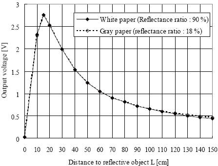

## Infrared (IR) Range Sensor

A common range sensor is the Sharp IR sensors which almost every
electronics source sells. These sensors output a beam of modulated light
and look for its return. Based on the time of flight, an analog voltage
is returned (see below).

Notice that, although the sensor takes 5V in, it outputs no more than
2.8V. There for this sensor is safe to work with common 3.3V systems.

# References

- [Sharp sensor datasheet](datasheet.pdf)
- [wikipedia: Infrared](https://en.wikipedia.org/wiki/Infrared)
