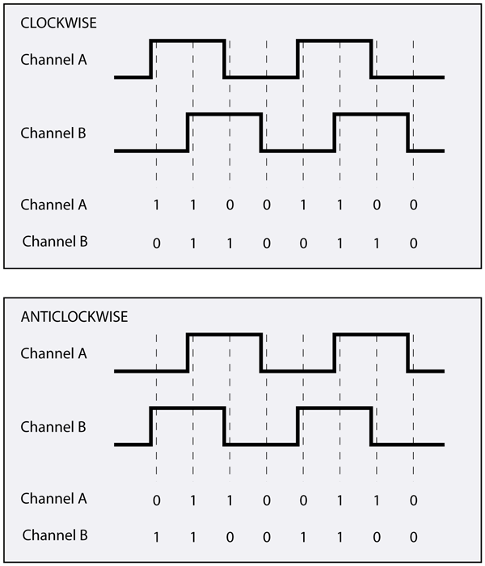

There are many types of encoders, above is a US Digital encoder designed
to be mounted on a motor shaft.


The optical encoder, shines a series of lights through an encoder disk
and the light is detected or not detected on the other side of the
encoder disk by some photoreceptors. A quadrature encoder has 2 signals,
A and B, which are phased such that they are *never* high or low at the
same time. Depending on the phase of the signals, the direction can be
determined.


The animation shows the signals produced from the movement of the motor
shaft, with the encoder disk attached to it.



Again, the wave form from A and B tells us if the wheel (motor shaft and
disk) are moving in the forward or reverse direction. Note that
forward/reverse are arbitrary and the engineer needs to determine if CW
or CCW is forward or reverse depending on how the sensor was mounted to
the robot.


The resolution of the encoder is determine by how the 2 signals are
read.

  - reading A and B on rising edge of A gives you the resolution of how
    many stripes there are on the disk
  - reading on the rising and falling edge of A gives you twice the
    resolution of the number of stripes on the disk
  - reading both A and B for both rising and falling edges gives you 4
    times the resolution as the number of stripes on the disk

Now, obviously, the last option gives you the greatest resolution and
the best performance ... so why wouldn't you do it? If the speed of your
microcontroller is too slow and/or the speed of your wheel is too fast,
you could get stuck answering interrupts all the time and never doing
anything else. You have to balance your system constraints properly.

## Python Pseudo Code

```python
import time
from serial import Serial

count = 0
COUNTS_TO_METERS = 0.001  # this depends on the encoder system

def main_loop():
  ser = Serial('/dev/tty.usbserial0', 115200)

  while True:
    time.sleep(1)  # time depends on speed of robot
    position += count * COUNTS_TO_METERS
    count = 0

    # a super simple serial response to report position
    if ser.read() == 'p':
      ser.write(position)

# an interrupt that gets called every time A or B changes
# you can do this with RPi.GPIO on the raspberry pi
def interrupt_AB():
  A, B = readEncoderPins()
  if A ^ B == 1:
    count += 1
  else:
    count -= 1
```

# References

  - [Dead Reckoning Wikipedia](https://en.wikipedia.org/wiki/Dead_reckoning)
  - [Interrupts](http://raspi.tv/2013/how-to-use-interrupts-with-python-on-the-raspberry-pi-and-rpi-gpio-part-3)
