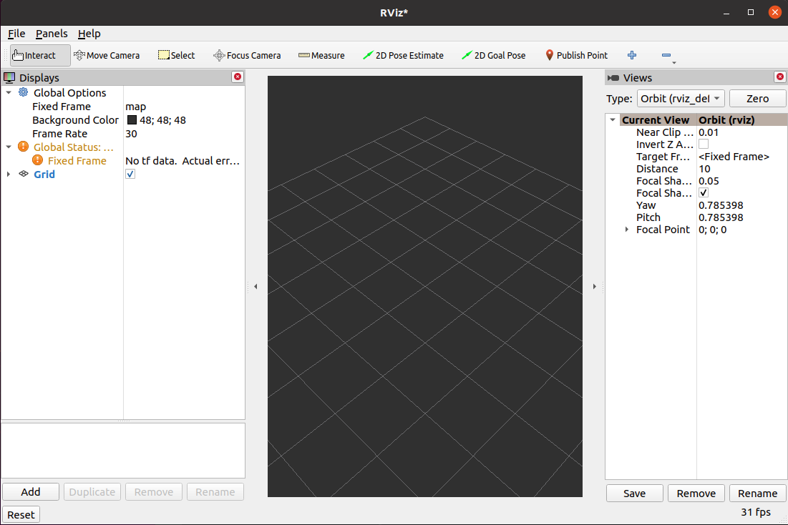
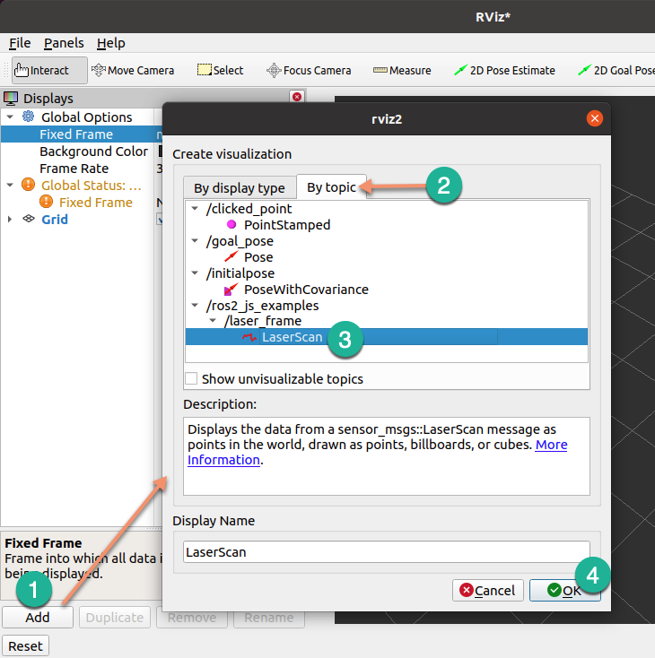
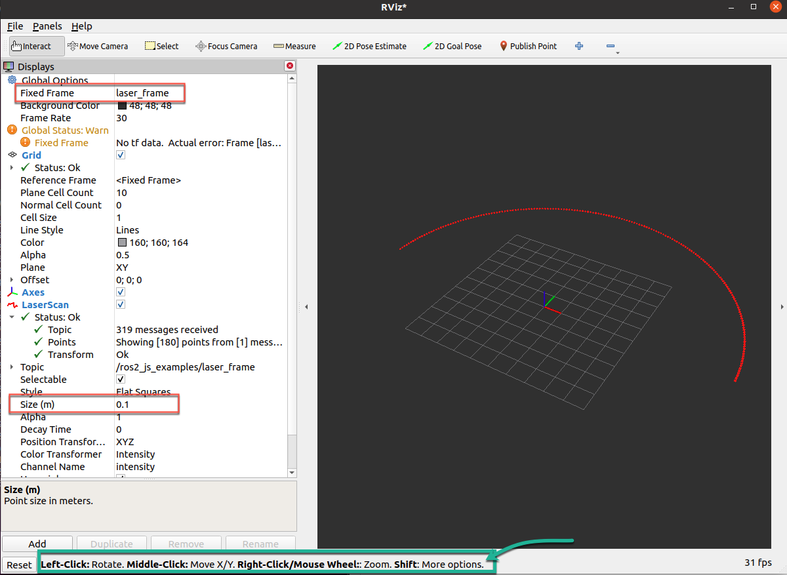

When you start, the screen will be empty.

Select the following:

Now you should see the lidar data points in the window:

# References

- rviz2 screenshots: [4: Data Visualization Using ROS 2 rviz2 and Pub-Sub Communications](https://medium.com/@ros2jsguy/4-data-visualization-using-ros-2-rviz2-pub-sub-communications-and-javascript-typescript-6e43cde75029)
