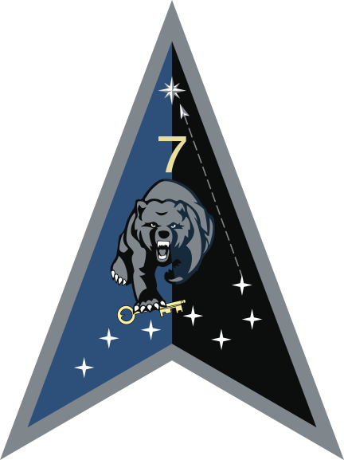
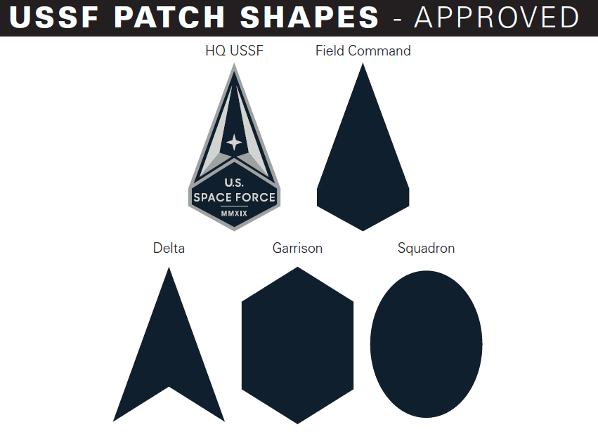

The patche shapes have meaning:

- Field commands (led by O-8/9) align with specific mission focuses, with the three field commands
    - Space Operations Command
    - Space Systems Command
    - Space Training and Readiness Command
- Deltas (led by O-6) are trained for specific missions and operations seen as the equivalent of Army brigades
- Garrisons are responsible for providing support functions to Deltas assigned to their installations such as base security, civil engineering, public affairs, physicians and chaplains
    - Garrisons do not oversee space Deltas, they are peer organizations

# References

- wikipedia: [Structure of US Space Force](https://en.wikipedia.org/wiki/Structure_of_the_United_States_Space_Force)
