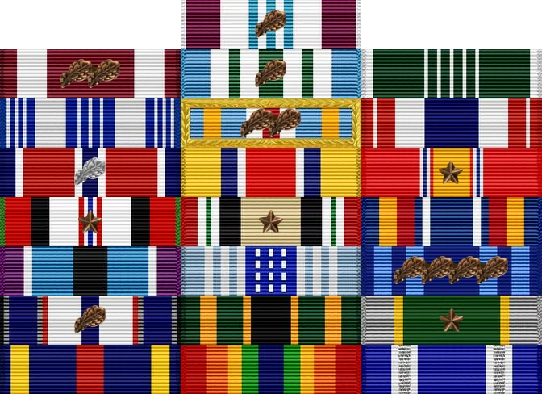

# Major Kevin Walchko

<figure>
    

    

    

    

</figure>

## Academics
- **2003 DOCTOR OF PHILOSOPHY**, Mechanical Engineering, University of Florida [*Funded through Fellowship from NASA Goddard Space Flight Center*]
- **2002 MASTERS IN SCIENCE**, Electrical Engineering, University of Florida
- **1999 MASTERS IN SCIENCE**, Mechanical Engineering, University of Florida [*Funded through Fellowship from NASA Goddard Space Flight Center*]
- **1997 BACHELOR OF SCIENCE**, Mechanical Engineering, University of Florida

## Deployments
- **2013** ISAF Joint Command, CJ2, ISR Directorate, Kabul, Afghanistan
- **2009** Defense Contract Management Agency-Southern Iraq, BIAP, Iraq

## Career

- **2024**  National Reconnaissance Office, Chantilly, VA
    - Chief, COMM Lifecycle Readiness
- **2021** AFRL Space Vehicles Directorate, Kirtland AFB
    - Chief Engineer, Oracle cislunar SSA mission
    - Program Manager, UHF Demo Satellite
- **2019** National Geospatial Intelligence Agency (NGA), Springfield, VA
    - Test Director, integrating revolutionary overhead capabilities to the NSG
- **2016** Dean of Faculty, US Air Force Academy, Co Sprints, CO
    - Director of Operations, oversaw Electrical and Computer Engineering Dept's curriculum
- **2014** Commandant of Cadets, US Air Force Academy, Co Springs, CO
    - Division Chief, Plans, responsible for all military instruction for cadets
- **2010** National Reconnaissance Office, Chantilly, VA
    - Develop and deliver on-orbit SAP systems
- **2006** Space Superiority Systems Wing, Los Angeles AFB
    - Develop and deliver on-orbit SAP systems
- **2003** AFRL Space Vehicles Directorate, Kirtland AFB
    - Deputy Program Manager, $300M lasercomm payload program for LAAFB MJPO

## Professional Schools
- **2014** Air Command and Staff College, correspondence
- **2010** Squadron Officer School, residence & correspondence
- **2004** Air and Space Basic Course, residence

### Publications

* Thomas B., Bracamonte, M., Kim H., Talosaga A., and Walchko K., "R2D2 Capstone Project", 15th Annual CSURF, Colorado Springs, CO, 28 April 2019.
* [Hindman, C., Engberg, B., Hunt, J., and Walchko, K., "Optimal GEO Lasercomm Terminal Field of View for LEO Link Support";, SPIE Free-space Laser Communications Technologies XVIII, 2006.](Publications/Optimal-geo-lasercom.pdf)
* [Hindman, C., Walchko, K., and Spratley, C., "Point-ahead Tracking for Space to Air Laser Pointing", MSS Active Electro-Optic Sensor Systems Conference, Columbia, MD, 2005.](Publications/unknown.pdf)
* [Grzywna, J., Walchko, K., and Nechyba, M., Subjugator: A Reconfigurable AUV, 2nd AIAA Systems, Technologies, and Operations Aerospace, Land, and Sea Conference and Workshop & Exhibit, San Diego, CA, Sept 15-18, 2003.](Publications/AIAA-Reconfigurable-AUV.pdf)
* [Walchko, K., "Robust Attitude Control with Disturbance Compensation," Ph.D. Dissertation, University of Florida, Gainesville, FL, 2003.](Publications/walchko-PhD-ME.pdf)
* [Walchko, K., Nechyba, M., Schwartz, E., and Arroyo, A., "Embedded Low Cost Inertial Navigation System," Florida Conference on Recent Advances in Robotics, FAU, Dania Beach, FL, May 8-9, 2003.](Publications/walchko-INS-FCRAR-2003.pdf)
* [Walchko, K., Novick, D., and Nechyba, M., "Development of a Sliding Mode Control System with Extended Kalman Filter Estimation for Subjugator," Florida Conference on Recent Advances in Robotics, FAU, Dania Beach, FL, May 8-9, 2003.](Publications/walchko-SM-FCRAR-2003.pdf)
* [Walchko, K., "Low Cost Inertial Navigation,", Masters Thesis, University of Florida, Gainesville, FL, August, 2002.](Publications/walchko-MS-EE.pdf)
* [Grzywna, J., Laine, J., Walchko, K., Dye, R., Jain, A., Ivano, N., Nechyba, M., Eric M. Schwartz, Arroyo, A., Subjugator 2002, 5th International Autonomous Underwater Vehicle Competition, San Diego, CA, July 31 Aug. 4, 2002.](Publications/AUVSI-2002.pdf)
* [Walchko, K. and Mason, P., Inertial Navigation, Florida Conference on the Recent Advances in Robotics, Miami, FL, 23-24 May 2002.](Publications/walchko-nav-FCRAR.pdf)
* [Grzywna, J., Laine, J., Walchko, K., Dye, R., Jain, A., Ivano, N., Nechyba, M., Eric M. Schwartz, Arroyo, A., Subjugator: The Development of an Autonomous Underwater Vehicle, Florida Conference on the Recent Advances in Robotics, Tallahassee, FL, 10-11 June 2001.](Publications/subjugator-FCRAR.pdf)
* [Grzywna, J., Kanowitz, S., Laine, J., Nortman, S., Novick, D., Walchko, K.,Nechyba, M., Eric M. Schwartz, Arroyo, A., SubjuGator: Sinkin' is Easy, AIAA Conference, Sep 2003.](Publications/subjugator-sinkin-is-easy.pdf)
* [Walchko, K. and Mason, P., Development of a Fuzzy Sliding Mode Controller for Satellite Attitude Control, Graduate Student Research Project Report, Fall 2000.](Publications/walchko-GSRP.pdf)
* [Walchko, K., Mason, P., and Crane, C., A MIMO fuzzy Controller for Tracking: Robot Control, Florida Conference on the Recent Advances in Robotics, Gainesville, May 1999.](Publications/mimo-fuzzy-FCRAR.pdf)
* [Walchko, K. and Mason, P., Intelligent Attitude Control with Uncertainty and Disturbance Compensation, Flight Mechanics and Estimation Technology Symposium, NASA Goddard, May 1999.](Publications/Optimal-geo-lasercom.pdf)
* [Walchko, K., "Development of a Generic Fuzzy Logic MIMO Controller for Attitude Control,", Masters Thesis, University of Florida, Gainesville, FL, April, 1999.](Publications/walchko-MS-ME.pdf)
* [Petroff, N., Mason, P., and Walchko, K., "Numerical Stability Analysis of a Fuzzy Controller," Artificial Neural Networks in Engineering, St. Louis, Ms, 1-4 Nov. 1998. (First Runner-Up for best paper).](Publications/unknown.pdf)
* [Walchko, K. and Mason, P., "Development of a Generic Hybrid Fuzzy Controller, Artificial Neural Networks in Engineering, St. Louis, Ms, 1-4 Nov. 1998.](Publications/unknown.pdf)
